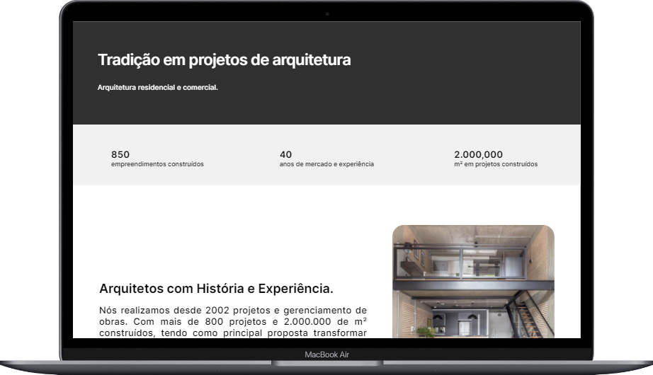

<h1 align="center"> Landing Page Arquitetura </h1>

Trilha de Tecnologia Full Stack DNC  

  <a href="#-tecnologias">Tecnologias</a>&nbsp;&nbsp;&nbsp;|&nbsp;&nbsp;&nbsp;
  <a href="#-projeto">Projeto</a>&nbsp;&nbsp;&nbsp;|&nbsp;&nbsp;&nbsp;
  <a href="#-layout">Layout</a>&nbsp;&nbsp;&nbsp;|&nbsp;&nbsp;&nbsp;
  <a href="#memo-licença">Licença</a>

  

 

  

## 🚀 Tecnologias

Esse projeto foi desenvolvido com as seguintes tecnologias:

- HTML e CSS
- JavaScript
- Git e Github
- Figma

## 💻 Projeto

O projeto Landing Page tem como base a aplicação de HTML, CSS e criação de funcionalidades com JavaScript para base fixação de conteúdo, afim de estudos.

### Desafio 01 - Resolução:

- [Projeto online](https://landingpag-arq.netlify.app/)
- [Planilha de dados](https://encurtador.com.br/eEFW2)

## 🔖 Layout

Você pode visualizar o layout do projeto através [DESSE LINK](https://www.figma.com/file/0FRiZbs30dfSniazKiM1rM).  
É necessário ter conta no [Figma](https://figma.com) para acessá-lo.

## 📋 Licença

Esse projeto está sob a licença MIT.

---

Feito por Felipe Destro com aulas da [Escola DNC](https://www.escoladnc.com.br/) 👋
